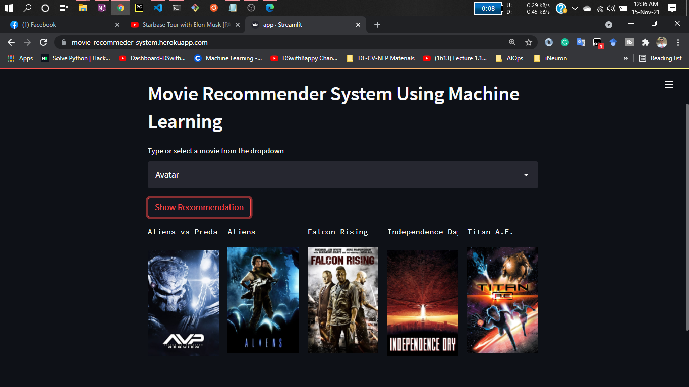

# Project: Movie Recommender System Using Machine Learning!

# About this project:

This is a streamlit web application that can recommend various kinds of similar movies based on an user interest.
here is a demo,

* [Click here to run it live on server](https://movie-recommender-system-ml-xpehuexxnm4uwqqejkgce2.streamlit.app/)

# Demo:

# Dataset has been used:

* [Dataset link](https://www.kaggle.com/tmdb/tmdb-movie-metadata?select=tmdb_5000_movies.csv)

# Concept used to build the model.pkl file : cosine_similarity

1 . Cosine Similarity is a metric that allows you to measure the similarity of the documents.

2 . In order to demonstrate cosine similarity function we need vectors. Here vectors are numpy array.

3 . Finally, Once we have vectors, We can call cosine_similarity() by passing both vectors. It will calculate the cosine similarity between these two.

4 . It will be a value between [0,1]. If it is 0 then both vectors are complete different. But in the place of that if it is 1, It will be completely similar.

